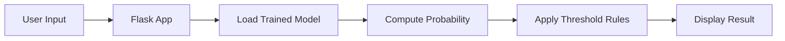

# 🛡️ Online Payments Fraud Detection using Machine Learning


> 🚀 Real-time fraud detection system powered by Machine Learning and Flask.

---

## 📌 Project Overview

**Online Payments Fraud Detection using Machine Learning** is an intelligent web-based system designed to proactively identify fraudulent financial transactions in real time.

The system leverages historical transaction data and a trained **Random Forest classifier** to distinguish between legitimate and suspicious activities based on key transactional features.

A Flask-powered dashboard allows users to input transaction details and instantly receive fraud predictions along with confidence scores.

---

## 🎯 Objectives

- ✅ Detect fraudulent online payment transactions  
- ✅ Provide real-time ML predictions  
- ✅ Build an interactive Flask web interface  
- ✅ Display model confidence  
- ✅ Support future adaptive fraud prevention  

---

## ⚙️ Key Features

- 🔹 Real-time fraud prediction  
- 🔹 Random Forest ML model  
- 🔹 Confidence score display  
- 🔹 Clean responsive UI  
- 🔹 Modular architecture (service-based)  
- 🔹 Error handling and validation  
- 🔹 Ready for periodic model retraining  

---

## 🧠 Machine Learning Details

**Algorithm:** Random Forest Classifier  
**Learning Type:** Supervised Classification  

### 📥 Input Features

- Step  
- Transaction Type  
- Amount  
- Old Balance (Origin)  
- New Balance (Origin)  

### 📤 Output

- `1 → Fraud`
- `0 → Safe`

---

## 🔄 Prediction Workflow


## 🏗️ Project Structure
```git
project/
│
├── app/
│   ├── services/
│   │   └── predictor.py
│   ├── routes.py
│   ├── config.py
│   └── __init__.py
│
├── templates/
├── static/
├── model.pkl
├── run.py
└── README.md
```

## 🚀 Installation & Setup
## 1️⃣ Clone Repository
```bash
git clone (https://github.com/nagur18/online-payment-fraud-detection.git)
cd https://github.com/nagur18/online-payment-fraud-detection.git
```
## 2️⃣ Create Virtual Environment
```bash
python -m venv venv
```
## Activate (Windows)
```bash
venv\Scripts\activate
```

## 3️⃣ Install Dependencies
```bash
pip install flask numpy scikit-learn pandas
```
## 4️⃣ Run the Application
```bash
python run.py
```

## 🧪 Sample Test Cases
# ✅ Safe Transaction
```table
Field	Value
Step	1
Type	0
Amount	2000
Old Balance	5000
New Balance	3000
```
# 🚨 Fraud Transaction
```
Field	Value
Step	1
Type	4
Amount	500000
Old Balance	500000
New Balance	0
```
## 🔮 Adaptive Fraud Prevention (Design Support)

* The current system performs real-time detection using a pre-trained model.
* The architecture supports periodic retraining with new transaction data, enabling adaptive fraud prevention against evolving fraud patterns.
* 
## ⚠️ Limitations

* Static trained model (no automatic online learning yet)
* Depends on dataset quality
* Not connected to live banking systems
* Limited user behavioral analysis

## 🚀 Future Enhancements

🔹 Online learning pipeline

🔹 User behavior profiling

🔹 Model drift detection

🔹 REST API deployment

🔹 Cloud deployment

🔹 Deep learning models

## 🎓 Viva Highlights

* Real-time ML inference using Flask

* Random Forest for tabular fraud detection

* Threshold tuning for imbalanced data

* Service-layer architecture

* Adaptive-ready design

## 👨‍💻 Author

 * Nagur Vali Ullaganti
 * 🎓 B.Tech – Computer Science & Engineering
 * 🤖 Specialization: Artificial Intelligence & Machine Learning

## ⭐ Support

-> If you found this project helpful, consider giving it a ⭐ on GitHub.

## 📜 License

-> This project is developed for academic and educational purposes.
